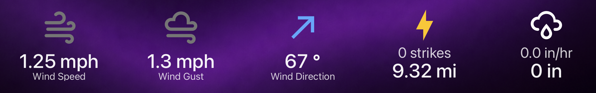

# Simple Button Card

A simple but extremely customizable HA button card.

I got very tired of not being able to adjust fonts and icons the exact way I wanted without using HTML inside the very raw custom:button-card. Even simple stuff like font size was simply not adjustable, much less templatable.

So I started coding this card with the help of GPT 5.4/5.5 Codex and I added everything that I had missed. You can template just about everything, you can make the icon as big as you want, you can make it transparent, you can make the icon change with simple templates...but it does support state icons and state colors natively :)



## Install
You can install using HACS:

[](https://my.home-assistant.io/redirect/hacs_repository/?owner=inventor7777&repository=ha-simple-button-card&category=plugin)

Or manually add the card as a Lovelace resource:

- URL: `/path/to/simple-button-card.js`
- Type: `module`

## Features

- Native Home Assistant `tap_action`, `hold_action`, and `double_tap_action`
- Optional entity-backed `state-badge` icon rendering
- Live `icon_color_template` updates
- Template-driven icon, title, and subtext content
- Template-driven icon, title, and subtext sizes
- Optional subtext displayed above or below the main title
- Optional icon top-attach mode
- Optional transparent mode that removes both the card background and shadow
- Built-in visual editor with `Icon`, `Title`, `Subtext`, and `Interactions` sections
- Section view sizing through `grid_options`

## Example

```yaml
type: custom:simple-button-card
entity: sensor.ev_battery
icon_template: mdi:car-electric
icon_color_template: >
  
  {{ '#4CAF50' if level >= 80 else '#FFB300' if level >= 30 else '#F44336' }}
icon_size_template: "84"
text_template: "{{ states('sensor.ev_battery') }}%"
text_size_template: "28"
secondary_text_template: "{{ states('sensor.ev_range') }} mi"
secondary_text_size_template: "13"
secondary_text_above: false
icon_attach_top: false
transparent_mode: false
text_weight: 600
secondary_text_weight: 400
text_padding_top: 0
text_padding_bottom: 0
secondary_text_padding_top: 0
secondary_text_padding_bottom: 0
icon_padding_top: 0
icon_padding_bottom: 0
side_padding: 16
tap_action:
  action: more-info
hold_action:
  action: navigate
  navigation_path: /dashboard-mobile/ev
double_tap_action:
  action: url
  url_path: https://example.com
grid_options:
  rows: 3
  columns: 3
```

## Main Options

### Root

- `entity`
- `transparent_mode`
- `side_padding`
- `grid_options.rows`
- `grid_options.columns`

### Icon

- `icon_template`
- `icon_color_template`
- `icon_size_template`
- `icon_attach_top`
- `icon_padding_top`
- `icon_padding_bottom`

### Title

- `text_template`
- `text_size_template`
- `text_weight`
- `text_padding_top`
- `text_padding_bottom`

### Subtext

- `secondary_text_template`
- `secondary_text_size_template`
- `secondary_text_weight`
- `secondary_text_padding_top`
- `secondary_text_padding_bottom`
- `secondary_text_above`

### Interactions

- `tap_action`
- `hold_action`
- `double_tap_action`

## Notes

- Size template fields should be strings in YAML, for example `icon_size_template: "90"`.
- If a size template is blank or resolves to an invalid value, the card falls back to built-in defaults:
  `72` for icon size, `24` for title size, and `13` for subtext size.
- If `text_template` is blank, the card falls back to the entity state and unit, then `friendly_name`.
- If `secondary_text_template` is blank, no subtext is shown.
- If `icon_template` is blank and `entity` is provided, Home Assistant handles the icon through `state-badge`.
- `icon_attach_top: true` pins the icon wrapper to the top and ignores icon top/bottom padding.
- `secondary_text_above: true` renders subtext above the main title.
- `transparent_mode: true` makes the card fully visually transparent by clearing both the background and the card shadow.

*Full disclaimer: This was fully vibe coded by GPT 5.4 Codex. However, I personally use this card and I am happy with it, so I decided to post in case it could help anyone else.*
